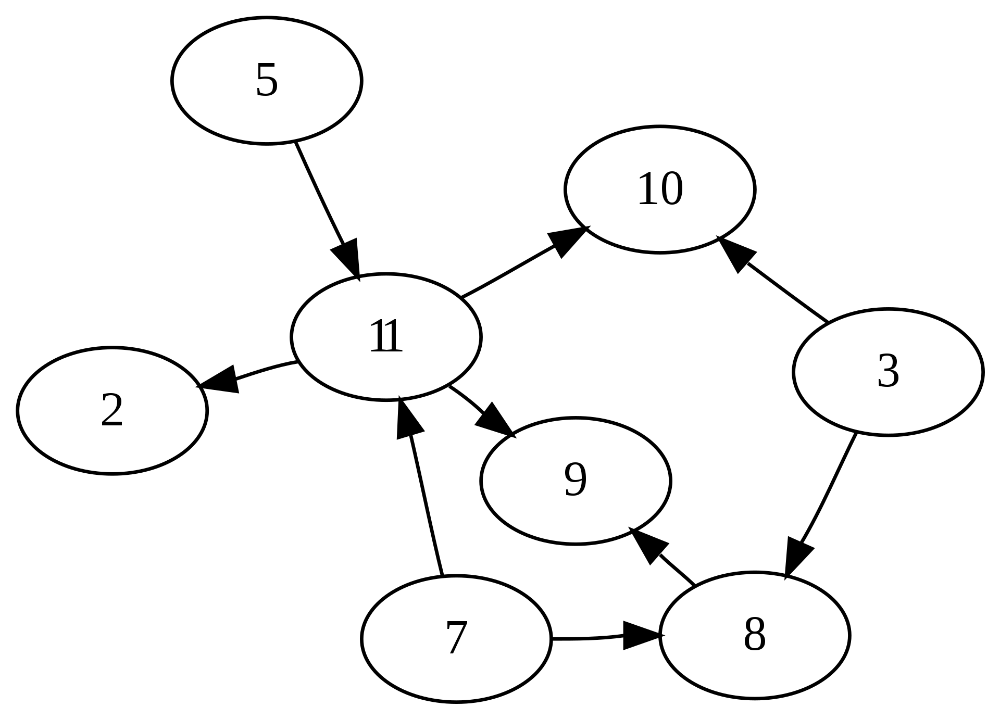

# 拓扑排序

拓扑排序定义即说明：https://zh.wikipedia.org/zh-hans/%E6%8B%93%E6%92%B2%E6%8E%92%E5%BA%8F

- 特别说明：只有[有向无环图](https://zh.wikipedia.org/wiki/%E6%9C%89%E5%90%91%E6%97%A0%E7%8E%AF%E5%9B%BE)才能被排序

## 卡恩算法

卡恩于 1962 年提出的算法。简单来说就是，假设 L 是存放结果的列表，先找到那些入度为零的节点，把这些节点放到 L 中，因为这些节点没有任何的父节点。然后把与这些节点相连的边从图中去掉，再寻找图中的入度为零的节点。对于新找到的这些入度为零的节点来说，他们的父节点已经都在 L 中了，所以也可以放入 L。重复上述操作，直到找不到入度为零的节点。如果此时 L 中的元素个数和节点总数相同，说明排序完成；如果 L 中的元素个数和节点总数不同，说明原图中存在环，无法进行拓扑排序。

## 例子说明

`index.js`对`cdns.js`中的 CDN 列表进行排序，根据相互依赖关系生成 script 标签插入到 html 中，此时就需要排出他们之间的顺序，确保 CDN 引入成功
