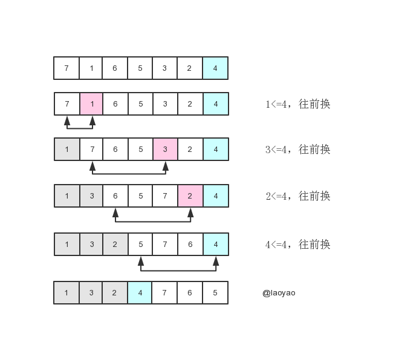

# 快速排序

## 原地分区



```js
// let array = [7, 1,  5, 3, 2, 4, 6]
// let j = 0
// let pivot = array[array.length - 1]
// for (let i = 0; i < array.length; i++) {
//   if (array[i] <= pivot) {
//     swap(array, i, j++)
//   }
// }
// console.log(array) // [ 1, 3, 2, 4, 7, 6, 5 ]
```
